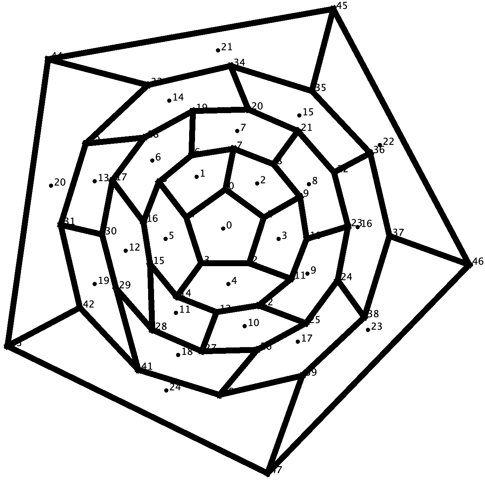
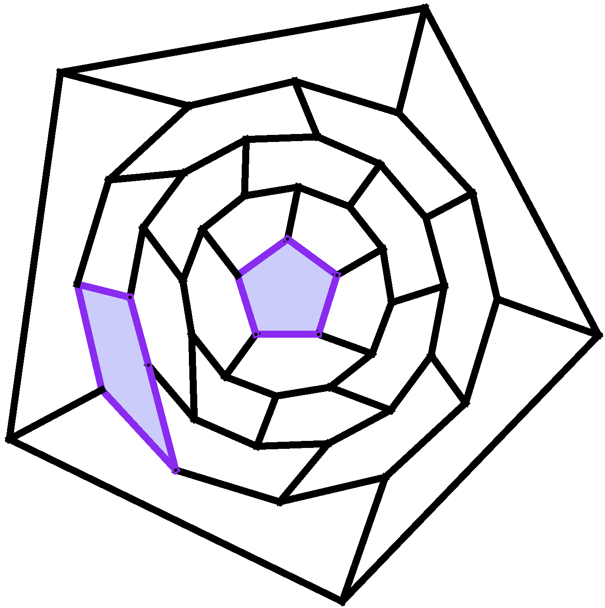
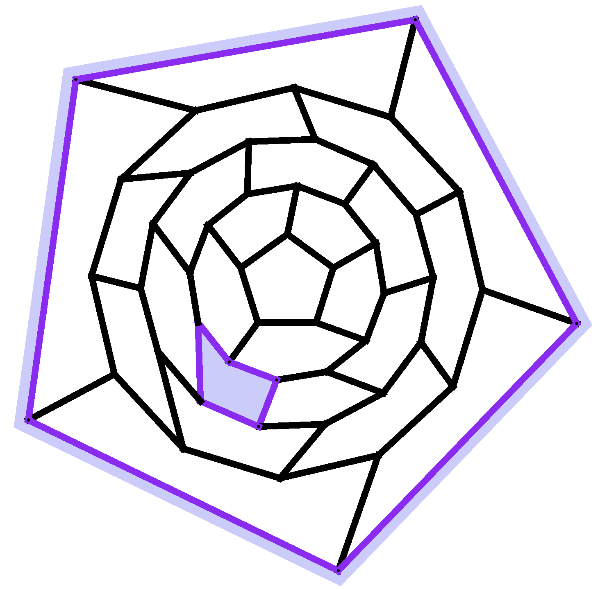

# A recursion to test for k-resonant and k-anionic-resonant fullerenes

## Background

### Definitions

A **fullerene** $F_n$ is a 3-regular graph such that every face is a pentagon
or a hexagon. By Euler's formula, there are exactly 12 pentagons. A fullerene
is said to be **k-resonant** if the deletion of the vertices of any $k$
independent hexagons results in a graph that admits a perfect
matching. This definition is inspired by the **Clar number** of a fullerene.
The **anionic Clar number** is a recent generalization of the Clar number to
anionic systems. In this generalization, pentagons compete with hexagons to
form Clar sextets. Given this generalization, we say that a fullerene is
**k-anionic-resonant** if the deletion of the vertices of any $k$ independent
pentagons results in a graph that admits a perfect matching.

### Testing for k-resonace and k-anionic-resonance

Given a fullerene $F_n$ and fixed integers $h$ and $p$, we use a recursion to
test whether the deletion of the vertices of any $h$ hexagons and $p$
pentagons, all pairwise independent, from $F_n$ results in a graph that admits
a perfect matching.

## Code

### Requirements:

1. A CPP+14 compiler.

2. A file containing fullerenes and their adjacency lists in a *particular*
 format. For each isomer in the file, please use the following format such
that **there exists a planar embedding of the vertices where each neighbor is
listed in clockwise order.** See `full/0X_adj` for examples for all fullerenes
on $X$ vertices, for $X \le 48$.  Buckygen
(https://github.com/evanberkowitz/buckygen) can be used to generate fullerenes
in this format. **Vertices should be labelled starting at 0.**

```
{number of vertices in graph (call it n)}
{degree of vertex 0} {neighbor 0} {neighbor 1} {neighbor 2}
{degree of vertex 1} {neighbor 0} {neighbor 1} {neighbor 2}
...
{degree of vertex n-1} {neighbor 0} {neighbor 1} {neighbor 2}
```

### Compile:

Code successfully compiles with GCC 14.2 (https://gcc.gnu.org/gcc-14/).

There are a some compiling flags you can change in `include.h`.

```
// For debugging purposes
#define DEBUG 0
#define DEBUG_DUAL 0
#define DEBUG_CLAR 0
```

The flags can be changed from 0 to 1 depending on what you want to debug
(you should not need to).

### To run:

```
./build/h_p_res {# of res. hexagons} {# of res. pentagons} < {fullerene file}
```

### Output:
Given a file of your input fullerenes, files will be written to `output/`.
If, for a given input fullerenes $F_n$, there exists a choice
of $h$ hexagons and $p$ pentagons (your inputs) that are pairwise
independent and the deletion of whose vertices results in a graph
that does not admit a perfect matching, the choice of hexagons
and pentagons will be recorded. This will be done for every such choice
of hexagons and pentagons per input fullerene.

```
res_faces_h_p <- File containing all choices of h hexagons and p pentagons that
result in a graph that does not admit a perfect matching. Format per row: {# of
faces} {face ids of res. face.}
graph_num_h_p <- File containing the graph ids (i.e. their numbering in the
input file) corresponding to fullerenes in file: res_faces_h_p
```

## Example:
See `output/` for an example output that test the 2-anionic-resonant condition
on all fullerenes on 48 vertices. This output shows that all fullerenes on 48
vertices, with the exception of isomers: $C_{48}$:3, $C_{48}$:4, and
$C_{48}$:32 (labelled in accordance with **The Atlas of Fullerenes**), are
2-anionic-resonant.

For isomer $C_{48}$:32, there exists two choices of two independent
pentagons, the deletions of whose vertices results in a graph
without a perfect matching. These two choices of resonant pentagons: (0, 19) and
(11, 25), indicated by the purple, are shown below.

<p align="center">



</p>

## Citation

If you use this code in your research, please cite it via:

```
@software{Slobodin_h_p_resonance_2025,
  author =        {Slobodin, A.},
  month =         jan,
  title =         {{A recursion to test for k-resonant and k-anionic-resonant fullerenes}},
  year =          {2025},
  url =           {https://github.com/fastbodin/h_p_res_fullerenes},
}
```
